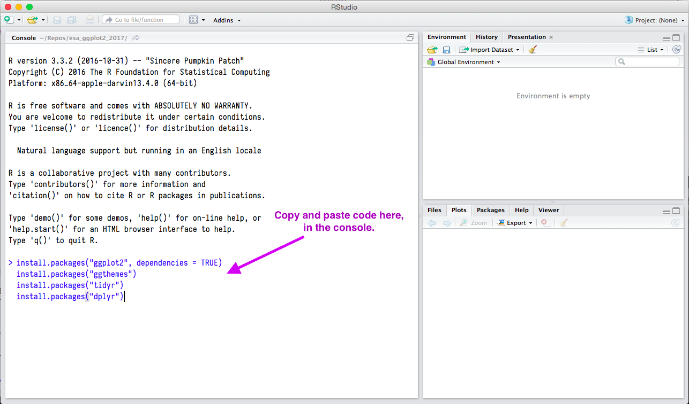
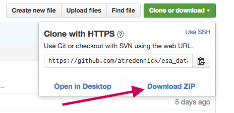

# ESA 2018 workshop on Data Visualization using R and ggplot2

Welcome to the GitHub repository data visualization using R and ggplot2.

**Location and time:**

* New Orleans Ernest N. Morial Convention Center - 340-341
* Sunday, August 05, 2018  08:00 AM - 11:30 AM

## Organizers
[Naupaka Zimmerman](http://naupaka.net) and [Andrew Tredennick](http://atredennick.github.io/)

## Instructor
[Naupaka Zimmerman](http://naupaka.net)

---

The R programming language is one of the most widely used tools for statistical analysis in the academic community. In addition to its large and ever-expanding suite of analytical tools, R is capable of producing publication quality figures that can easily be embedded into publications, presentations, and lab notebooks. In addition to its core functionality, the ability to do sophisticated visualization in R is enhanced by supplemental packages, most notably the ggplot2 library. In this workshop we move beyond basic plotting and highlight some of the more powerful approaches for visualization in R, focusing in particular on the functionality represented by the ggplot2 library (and associated packages). We will explain the 'grammar of graphics' that ggplot2 uses to build graphs and figures of all types. This workshop will also briefly cover the use of the dplyr and reshape2 packages, which are incredibly useful tools to format datasets before plotting and/or analysis. We will provide some example datasets beforehand but feel free to bring your own along with your laptop and a pre-installed copy of R and RStudio (available free online for all platforms at rstudio.com) to participate.

---

## Pre workshop instructions

**Important:** There will be wifi in conference rooms this year, but plan on spending 10 minutes Saturday night (or even before arriving in New Orleans) to download and install R and RStudio, to install the packages listed below, and to download a local copy of this repository (see instructions below). It takes a bit of bandwidth to do all this, so best not to rely on convention center wifi.

### Installing R
If you don't already have R set up with a suitable code editor, we recommend downloading and installing [R](http://cran.cnr.berkeley.edu) and [RStudio Desktop](http://www.rstudio.com/ide/download/) for your platform. Once installed, open RStudio and install the following packages. Simply paste these commands into your prompt.

### Installing packages

```coffee
install.packages("ggplot2", dependencies = TRUE)
install.packages("ggthemes")
install.packages("tidyr")
install.packages("dplyr")
```

You will want to copy and paste the above into the "Console" of RStudio, like below. After copying and pasting, simply hit 'enter', and you will see a bunch of text letting you know that they are being installed.



### Downloading code/data from this repository
Simply hit the **Download ZIP** button at the top-right of this page (scroll up to see it). If you're not sure where to save it, just download and unzip to your Desktop.



If you're having any trouble with these steps please drop me an [email](mailto:naupaka@gmail.com). I'll also strive to have local copies if you forget to install any of these tools.

See you Sunday!


---

# License

  <a rel="license" href="http://creativecommons.org/licenses/by/4.0/deed.en_US">Creative Commons Attribution 4.0 International License</a>.
